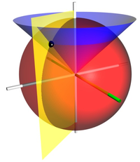
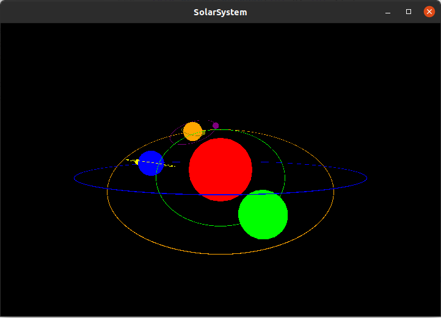
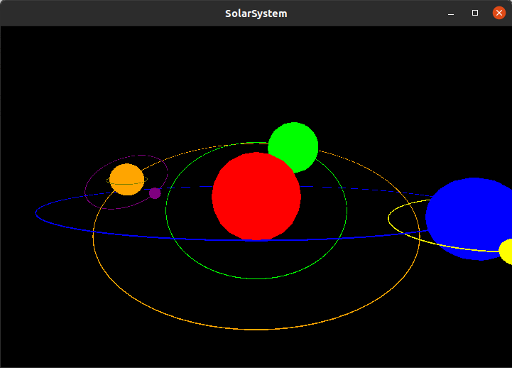
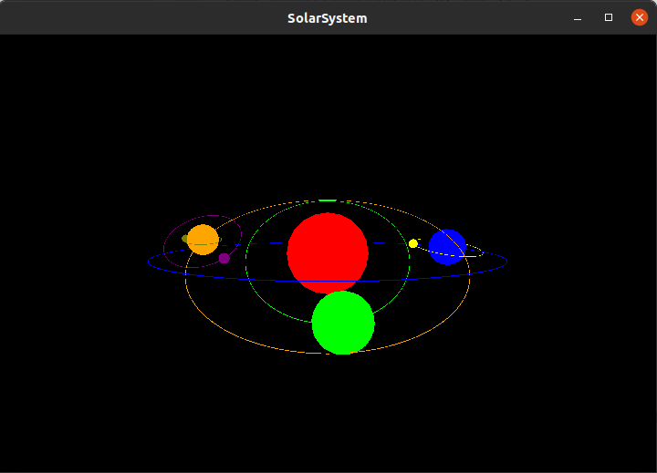
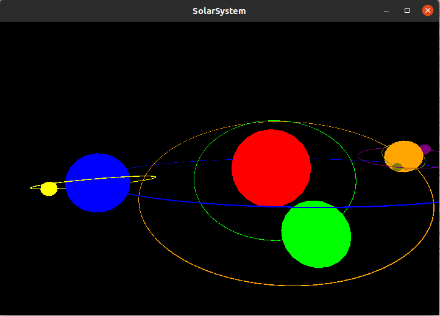
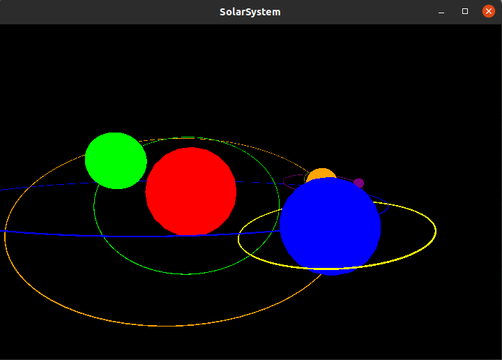
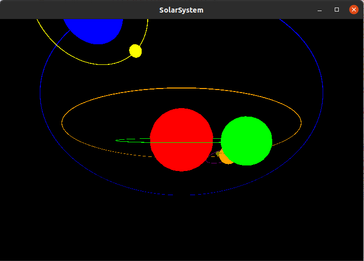
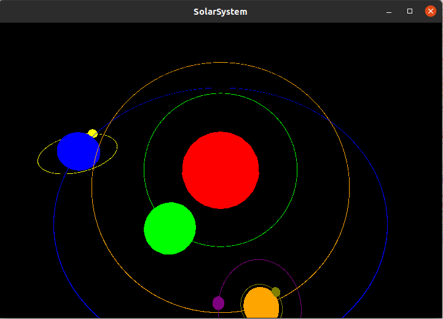
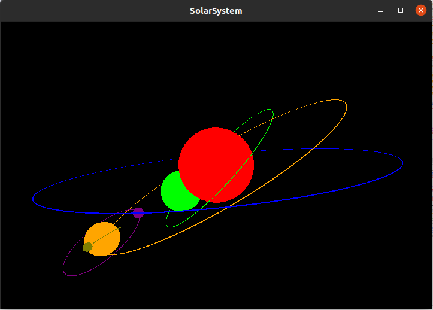

# Solar System

[TOC]

## 实验环境

* 实现语言：C++, OpenGL库：GLUT
* 系统环境：Linux (Ubuntu 20.04)

## 上下文配置

在此实验中，我们首先需要搭建的就是程序上下文，首先需要指定显示模式，在此实验中，为了实现星球之间的遮挡效果，我们必须要启用双缓冲区。

```c++
//初始化GLUT库
glutInit(&argc, argv);
//指定显示模式，使用双缓冲区
glutInitDisplayMode(GLUT_DOUBLE | GLUT_RGB | GLUT_DEPTH);
```

然后就是窗口属性的设置，我们需要设置窗口的位置、大小与名字

```c++
//设置窗口位置
glutInitWindowPosition(200, 200);
//设置窗口大小
glutInitWindowSize(720, 480);
//新建窗口并命名
glutCreateWindow("SolarSystem");
```

为了实现动画的效果和对动画的控制，我们需要设置功能处理函数，主要的处理函数注释如下

```c++
//设置正确投影的函数
glutReshapeFunc(Reshape);
//设置显示函数
glutDisplayFunc(Display);
//设置空闲时期执行函数
glutIdleFunc(&Idle);
//处理键盘输入
glutKeyboardFunc(GetInputKey);
//处理鼠标点击
glutMouseFunc(GetInputMouse);
//处理鼠标移动
glutMotionFunc(GetMotionMouse);
```

### Reshape函数

Reshape是当窗的形状改变事件与视角发生时，会调用的处理函数。在此函数中，首先需要处理的就是需要根据窗口的改变改变视口(viewport)，也即我们必须重新告诉OpenGL渲染窗口的尺寸大小，这样OpenGL才只能知道怎样相对于窗口大小显示数据和坐标。我们可以通过调用glViewport函数来设置窗口的维度。

```c++
glViewport(0, 0, width, height);
```

接下来就是投影矩阵并进行透视投影，而glMatrixMode()命令将当前矩阵设置成参数所指定的模式，以满足不同绘图所需执行的矩阵变换。一般而言，在需要绘制出对象或要对所绘制对象进行几何变换时，需要将变换矩阵设置成模型视图模式；而当需要对绘制的对象设置某种投影方式时，则需要将变换矩阵设置成投影模式；只有在进行纹理映射时，才需要将变换矩阵设置成纹理模式。对投影矩阵堆栈应用随后的矩阵操作, 为我们的场景增加透视。

```c++
glMatrixMode(GL_PROJECTION);
//重置当前指定的矩阵为单位矩阵
glLoadIdentity();
//gluPerspective定义的就是相机的内在镜头参数
gluPerspective(60.0f, (float)width / (float)height, 0.1f, 1000.0f);
//设置完成后切换到模型视图矩阵开始画图
glMatrixMode(GL_MODELVIEW);
```

除此之外，为了实现视角的改变，我们需要使用gluLookAt函数来调整相关参数

```c++
glLoadIdentity();
gluLookAt (eyex, eyey, eyez, centerx, centery, centerz, upx, upy, upz);
```

### 键盘与鼠标处理

键盘处理比较简单，只需要使用GetInputKey函数即可，在对应的按键执行对应的操作即可：当按下w模拟前进，这时gluLookAt函数的观察点位置在z轴前进即可，也即eyez减小，而按下s时则与之相反。当按下a键时，需要模拟向左转，只需将看向的位置左转，也即centerx减小，按下d反之。

而鼠标操作的逻辑是左键持续按住并且拖动的状态下才能够改变view direction，使用了两个函数来实现这一操作，一个函数控制鼠标左键是否按下的全局控制信号，但鼠标左键按下时，此信号置为true，并且记下当前鼠标所处的位置，当鼠标按下并拖动时，Motion处理函数会根据拖动的距离处理响应的角度改变大小。

```c++
void GetInputMouse(int button, int state, int x, int y) {

    if(button == GLUT_LEFT_BUTTON) {
        if(state == GLUT_DOWN)
            isLeftMousePress = true;
        else if (state == GLUT_UP)
            isLeftMousePress = false;
    }

    MouseX = x;
    MouseY = y;
}

void GetMotionMouse(int x, int y) {
    
    if(isLeftMousePress) {
        ViewX += (y - MouseY) * 0.1f;
        ViewY += (x - MouseX) * 0.1f;
        MouseX = x;
        MouseY = y;
    }

    float distance = sqrt(pow(eyex, 2) + pow(eyey, 2) + pow(eyez, 2));
    eyez = distance * cos(ViewX) * cos(ViewY);
    eyex = distance * cos(ViewX) * sin(ViewY);
    eyey = distance * sin(ViewX);
    glutPostRedisplay();
}
```

### 空闲时函数

空闲时函数主要用于更新星球显示角度并在此画图，以实现旋转的效果

```c++
void Idle() {
    //设置自转速度
    Day += 1.0;
    Day = Day >= 360 ? (Day - 360) : Day; 
    //设置公转速度
    fEarth = fEarth >= 360 ? (fEarth - 360) : (fEarth + 0.3f);
    fMoon  = fMoon  >= 360 ? (fMoon - 360) : (fMoon  + 2.4f);
    fMerrcury  = fMerrcury  >= 360 ? (fMerrcury - 360) : (fMerrcury + 0.4f);
    fMars  = fMars  >= 360 ? (fMars - 360) : (fMars  + 0.5f);
    fMarsSate1  = fMarsSate1  >= 360 ? (fMarsSate1 - 360) : (fMarsSate1  + 3.0f);
    fMarsSate2  = fMarsSate2  >= 360 ? (fMarsSate2 - 360) : (fMarsSate2  + 2.8f);
    //重新显示
    Display();
}
```


## 显示函数

### 星球的显示

本次实验的重点就是星球的显示，星球的绘制可以由glutSolidSphere完成，此函数第一个参数为球体半径，剩下两个参数与材质相关。而要使星球转动起来则需要使用每次改变一个小角度，再重新绘制的方法。根据此思想，我们使用glRotatef和glTranslatef即可实现星球运动的描述，同时根据星球的转轴和glutSolidTorus函数我们可以画出星轨，举地月系统的绘制为例。

```c++
void DisplayEarthAndMoon() {
    glPushMatrix();
    //设置颜色
    glColor3f(0.0f, 0.0f, 1.0f);
    /*画地球*/
    //画星轨
    glRotatef(atan(ry / rz) * 180 / Pi, -1.0, 0.0, 0.0);
    glutSolidTorus(0.01, 6.0, 64, 100);
    glRotatef(-atan(ry / rz)* 180 / Pi, -1.0, 0.0, 0.0);
    //地球的公转
    glRotatef(fEarth, rx, ry, rz);      
    glTranslatef(6.0f, 0.0f, 0.0f);
    //地球的自转
    glPushMatrix();
    glRotatef(Day, 0.0, 1.0, 0.0);  
    //绘制地球
    glutSolidSphere(0.8f, 20, 20);
    glPopMatrix();

    /*画月球*/
    glColor3f(1.0f, 1.0f, 0.0f);
    //画星轨
    glRotatef(atan(1.0 / 0.3) * 180 / Pi, -1.0, 0.0, 0.0);
    glutSolidTorus(0.01, 1.5, 64, 100);
    glRotatef(-atan(1.0 / 0.3)* 180 / Pi, -1.0, 0.0, 0.0);
	//月球的公转
    glRotatef(fMoon, 0.0, 1.0, 0.3);
    glTranslatef(1.5f, 0.0f, 0.0f);
    //月球的自转
    glRotatef(Day, 0.0f, 1.0f, 0.0f);
    //绘制月球
    glutSolidSphere(0.2f, 20, 20);
    glPopMatrix();
}
```

在此过程中，需要注意的是月球是围绕地球转动的，而地球是围绕太阳进行公转的，所以月球绘制的世界坐标系应该建立在地球坐标系上，这也是为什么需要使用glPushMatrix与glPopMatrix保存和恢复矩阵的原因。

### 星系的显示

显示函数也属于上下文框架的一部分，主要函数都在上下文部分都有介绍，在此不再赘述

```c++
void Display() {
    //清理缓冲区
    glClear(GL_COLOR_BUFFER_BIT | GL_DEPTH_BUFFER_BIT);
    //设置完成后切换到模型视图矩阵开始画图
    glMatrixMode(GL_MODELVIEW);
    //重新设置LookAt函数
    glLoadIdentity();
    gluLookAt (eyex, eyey, eyez, centerx, centery, centerz, upx, upy, upz);
    //绘制各星球
    DisplaySun();
    DisplayEarthAndMoon();
    DisplayMercury();
    DisplayMars();
    //刷新与交换缓冲区
    glFlush();
    glutSwapBuffers();
}
```

### View Diraction的改变

在此实验中View Diraction的改变我是通过改变gluLookAt函数的eyex，eyey，eyez，也即眼睛位置来实现视角的变换，同时变换的过程会保证眼睛与看向的点之间的距离恒定，而此实验中眼睛恒看向坐标原点，故呈现出眼睛在以恒定距离围绕原点做球面运动的现象。

在此实验中我通过两个角度变量确定视角的改变，一是眼睛(观察点)和原点连线与OpeGL坐标轴Z轴的夹角ViewX，二是此连线与XOZ平面的夹角为ViewY，鼠标的拖动会改变这两个角度，而这两个角度与连线的长度就能够确定观察点的坐标位置，将其传入gluLookAt函数即可实现View Diraction的改变。



(图源：https://zh.wikipedia.org/wiki/%E7%90%83%E5%BA%A7%E6%A8%99%E7%B3%BB)

同时类似与球坐标系，变化的公式如下

```c++
//观察点与连线之间的距离
float distance = sqrt(pow(eyex, 2) + pow(eyey, 2) + pow(eyez, 2));
//z轴坐标变化
eyez = distance * cos(ViewX) * cos(ViewY);
//x轴坐标变化
eyex = distance * cos(ViewX) * sin(ViewY);
//y轴坐标的变化
eyey = distance * sin(ViewX);
```

值得注意的是，由于gluLookAt的观察中心一直是坐标原点没有改变，所以当View Diraction上下翻动超过90度时，**gluLookAt会自动进行一个类似于转头的操作**，以保证“视线”始终指向观察中心。


## 操作方式

此实验使用了glut库，编译时需要引入

```makefile
g++ SolarSystem.cpp -o SolarSystem -lGL -lGLU -lglut
```

如果时linux系统运行，只需要执行附上的脚本compile.sh即可


## 实验结果

### 星系的实现



### Walk实现

前进



后退



左转向



右转向



### View Diraction改变

眼睛上移



眼睛下移



眼睛右移



眼睛左移


