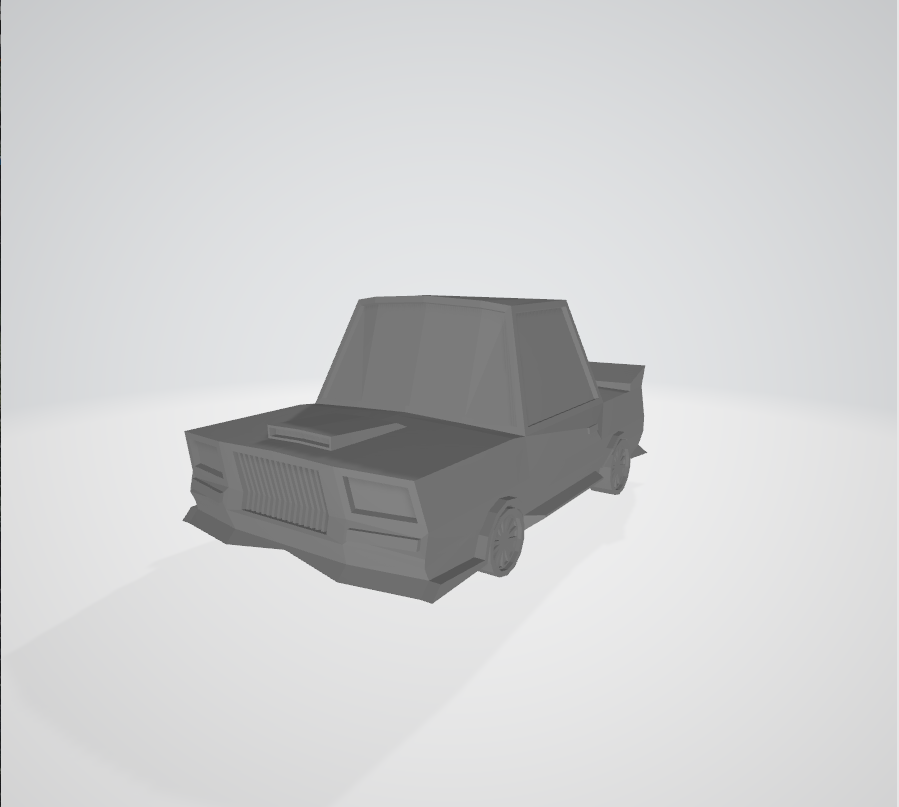
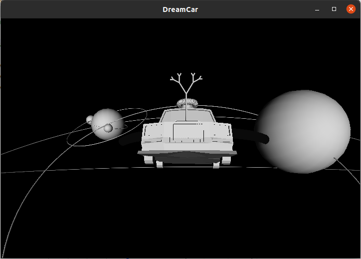
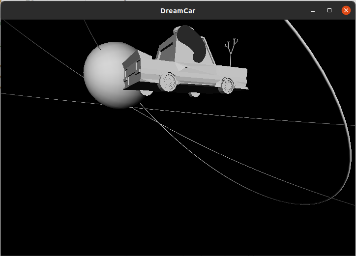
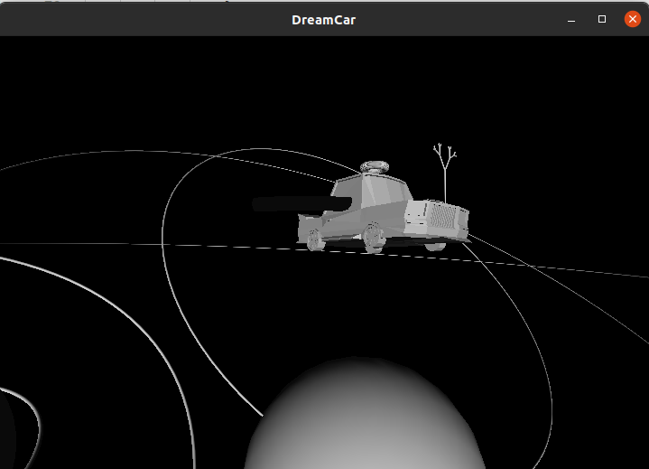

# AS#7: Design Your Dream Car

### 文件结构

Car.h：绘制Dream Car的相关函数

Car.obj：车子的主体

main.cpp：主函数，程序框架

compile.sh：编译运行的shell命令

main：可执行文件

### Modeling Techiques

* Polygonal Meshes

  

  直接使用网格模型中的点数据进行绘制，它被用来加载车子的主体。

  优点：

  * 高效，能够方便快捷的绘制出复杂的模型
  * 应用广泛
  * 可拓展性强，我们可以直接对网格进行操作和修改

  缺点：

  * 多边形无法准确表示曲面，模型会有一定地失真
  * 若是想要比较真实的模型，就需要大量多边形，而这种复杂的模型会使得绘制开销很大并且耗时长。

* L-system

  我使用了L-system来绘制车的车标

  

  优点：

  * 对绘制特定类型的模型非常有效，效率高且绘制过程简单
  * 不仅可以绘制一个模型，根据迭代次数的不同，可以绘制一类模型

  缺点：

  * 局限于几类模型，无法适用于大多数模型的绘制
  * 难以很容易的找出一个结构的L-system

* Sweeping

  

  

  我使用了sweep绘制了一个长的弧形管道和一个圆环管道，分别用来做氮气喷射管和聚能磁环。

  有点：

  * 对于绘制管道类的模型非常有效，并且很直观
  * 可以用它来简单编程生成大部分特定曲线类型的管道，无需Polygonal Meshes的复杂操作

  缺点：

  * 同样是局限于几类模型，无法适用于大多数模型的绘制

  * 由于是在模拟光滑曲线，Sweeping仍会产生一定程度的失真问题，若是想得到很好的效果，就必须减小间隔增加循环次数，这对复杂的管道来说是一笔不小的开销。

    